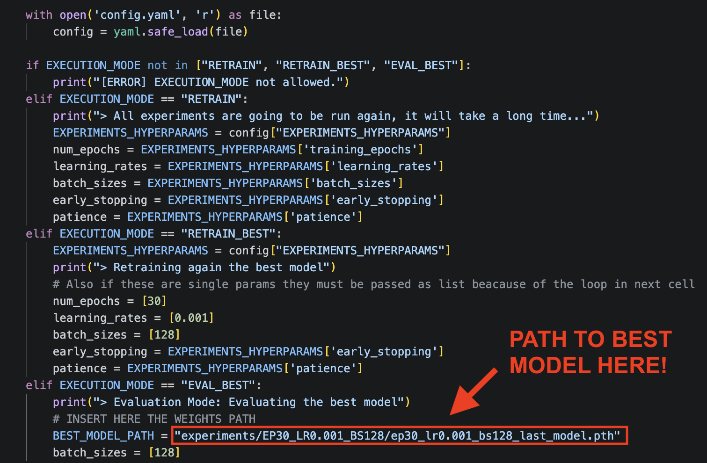

# From Pixels to Semantics
Author: Edoardo Canti 

---

This README is intended to be the **introduction** to the three distinct Jupyter Notebooks regarding the Deep Learning Application Laboratory 1 - From Pixels to Semantics. 

## Organization
### Involved files
0. `utils.py` (contains a from-scratch implementation of an experiment handler object and a scratch implementation of a MLP with the possibility of using two different weights initialization methods).
1. `config.yaml` (a yaml file that has been used across the notebooks in order to provide configurations for experiments).
2. `LAB1_exercise1-EDA.ipynb`
3. `LAB1_exercise1.2_1.3-BASELINE.ipynb`
4. `LAB1_excercise3.ipynb`

## LAB1_exercise1-EDA.ipynb
GTSRB dataset Exploratory Data Analysis. All the cells in the notebook can be executed without further clarification (no expensive computations involved).  
The main idea that drove the notebook's design has been:
> "I'm going to work with a dataset that I've never used, data were collected in a way that I didn't know, and especially were already split into training and test sets. Is there something that I should know before running my experiments?"

The notebook contains observations and analyses but, **SPOILER:** as discussed during flipped lectures, the problem can be considered as *not imbalanced*.

---

## LAB1_exercise1.2_1.3-BASELINE.ipynb
Here the starting point is to use a **pretrained model** (in this case ResNet-18) as a **feature extractor**, which consists of cutting out the classification head and then constructing a **baseline**. In this case, the baseline is a composition of **ResNet-18 (features extractor) + SVM** (consistent with flipped lecture); **results** regarding this part take into account also the analysis made in *LAB1_exercise1-EDA.ipynb*.

The next step is to **improve the produced baseline**. This has been done in two separate ways (for the Linear layer part, a from-scratch Grid Search HPO has been implemented):
- By using a Linear layer as a projector into the 43 classes space (the part in which I was more interested);
- By using a MLP. This has been done for mainly two reasons: I didn't use *Weights and Biases* for the Linear layer part (since I used the Experiment object) and I wanted to use it; also out of curiosity about the results.

The **Experiment** class has been designed in order to save images, data about training, and testing of the current model (if necessary, all results and plots could be provided).

### !!! Important Instructions !!!
This notebook contains an actual **Grid Search HPO implementation**. Instructions on **how to avoid the full grid search** are provided after the Hyperparameters values used during the Grid Search. 
 
Hyperparameters evaluated:
- **learning rates:** [0.01, 0.001, 0.0001]
- **batch sizes:** [128, 256, 512]
- **training epochs:** [10, 20, 30]

This notebook can be executed **ALMOST ENTIRELY** without attention needed, except for one section. 
The section is marked as **EXPERIMENT 1**. After all experiments concluded, the Experiment class and this notebook have been refactored in order to avoid the full running of the entire grid search. The notebook itself contains the instructions that are redundant to write here (I hope everything will be executable as during my tests). 
Just as a reminder, the following table is a highlight of possible ways to run **EXPERIMENT 1**:

| EXECUTION_MODE | Description |
| -------- | ------- |
| "RETRAIN"  | Executes **the entire Grid Search HPO** (*strongly* not recommended, since all results could be provided by the author). |
| "RETRAIN_BEST" | Retrains and evaluates only the best model found during experiments (it will execute only the pipeline on the best model). |
| "EVAL_BEST"    | Executes an evaluation using the test set on only the best model (recommended). | 

 

> **AT [THIS LINK](https://drive.google.com/file/d/1w5yS2jxBANOaACUpEQ8AYF70EPvdMixL/view?usp=share_link) YOU CAN DOWNLOAD THE WEIGHTS FOR THE BEST FINE-TUNED RESNET-18 + LINEAR LAYER.** 

**The image shows where you should add the path to the downloaded weights in order to use "EVAL_BEST":**

Then, **EXPERIMENT 2** was actually done. Almost the entire content of **LAB1_excercise3.ipynb** (except for the part named: *Just for completeness*) is about Fine Tuning ResNet-18 with a MLP instead of a Linear layer. 
In this part, there is **NO Grid Search HPO**, but only the best previously selected hyperparameters were used and the number of epochs has been halved. 
The **MLP class** in `utils.py` allows creating a MLP instance with several types of weight initialization (actually only He init has been tested).

---

## LAB1_excercise3.ipynb
In this exercise, the **chosen path** has been the **one about embeddings.** 
Despite the **NMC-based Retrieval** having been implemented, the notebook is divided into three parts:
1. Manifolds Explorations (3-dimensional)
    - Using ResNet-18 as Features Extractor.
    - Principal Component Analysis with Vanilla ResNet-18 (not fine-tuned): **without embeddings normalization** and **with embeddings normalization**.
    - Principal Component Analysis with Fine-Tuned ResNet-18: **without embeddings normalization** and **with embeddings normalization**.
    - Cluster Analysis on all of the four previously defined configurations.
2. Embeddings Retrieval with **NMC + Cosine Similarity** using fine-tuned produced embeddings.
3. Bonus part regarding a different *dimensionality reduction method*, namely: **Diffusion Maps**, a technique I read about in the article [Manifold Learning: what, how and why?](https://arxiv.org/abs/2311.03757), that is already implemented in **SkLearn** as *Spectral Embeddings* (details about implementation in the notebook).
4. *Just for completeness*: this part is the last and it consists of the exploration of the 3-dimensional manifold produced by Fine-Tuned ResNet-18 + MLP.

This notebook contains simple and interactive plots. The interactive plots have been produced using Plotly, which has a very useful and nice impact on the look of the produced manifolds.