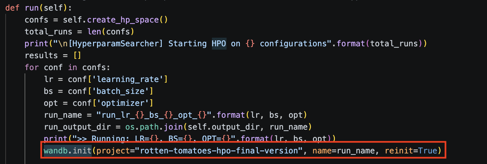
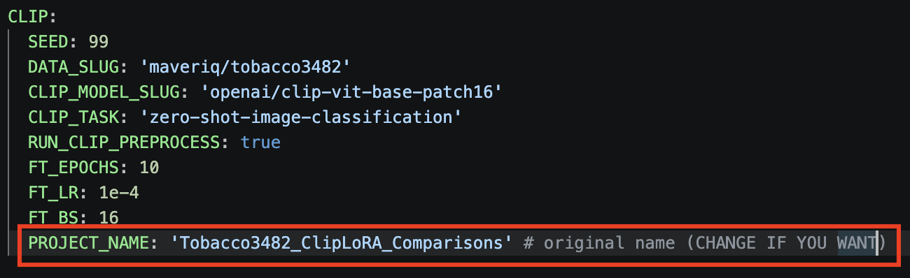

# The Transformative Transformer

Author: Edoardo Canti

---

This second lab exercise will be divided into *single python files* for exercises 1 and 2 and a jupyter notebook for exercise 3.

## About the Virtual Environment:
This LAB has a different *conda* environment (DLA-CLIP2) wrt the one provided in flipped lecture. Requirements are reported in `requirements.txt`

## Organization
### Directories and Files:
0. `requirements.txt`: requirements for the used conda environment.
1. `configs/config.yaml` a yaml file that has been used across the files in order to provide configurations;
2. `utils/` contains several function that will be used throughout the designing process:
    * `CustomTokenizer.py`: This is a custom wrapper for huggingface tokenizer with some added behavior of interest;
    * `helpers_functions.py`: a single file that contains all needed helpers functions used accross standalone files and notebooks;
    * `HyperparamOptim.py`: contains the HyperparamSearcher object used in file `LAB2_exercise2`, this has been written in order to use the Trainer HuggingFace object in an HyperParameters Optimization process
3. `src/` Contains the code related to exercises 1 and 2:
    * `LAB2_exercise1_1.py`: is about exercise 1.1, used in order to understand how to work with HF datasets and computes some statistics that *could* be useful in future (stats can be found in directory *data_stats/*)
    * `LAB2_exercise1_2.py`: related to exercise 1.2: custom code done for computing statistics about tokens, saving the vocabulary and check the presence of UNKNOWN tokens in the current dataset (rotten tomatoes), also this is a kind of testing of CustomTokenizer. As requested the final part is an example of execution of AutoModel.
    * `LAB2_exercise1_3.py`: related to exercise 1.3: using DistilBERT as features extractor and using SVM ad a classifier based on those features, as reported in comments Optuna was used in order to select between different kernels and regularization params over SVM (probably it wouldn't have been necessary considering that this would have become a baseline)
    * `LAB2_exercise2.py`: This file contains all sub exercises of exercise2: also an HPO was applied with the Trainer in order to decide which optimizer, batch_size and learning rate apply.
4. `notebooks/` Contains a single notebook for exercise 3:
    * `LAB2_exercise3.ipynb`: this is the chosen track file. It represents the implementation of track **Fine Tuning a CLIP Model**,<br> the exercise was chosen in order to take familiarity with the CLIP model and especially because it incorporates ideas of representations and contrastive learning. The notebook (as previous files) uses calls to function defined in `utils/helpers_functions.py` and the main idea has been the following: *What happens if we train the CLIP encoders in an alternating manner on a dataset containing images that it probably (cannot be sure about this) haven’t seen during the pre-training phase?*
5. `artifacts/`: by looking at config.yaml, if EXEC::recompute_embedding == true, this directory will be created starting from `LAB2_exercise1_3.py` and will be populated with:
    * `training_cls_embeddings.pt` 
    * `val_cls_embeddings.pt` 
    * `test_cls_embeddings.pt`
    * `tokenized_data/`: created during exercise 2.1 and populated with tokenized data 
    * `clip_input`: created during exercise 3 and populated with embeddings of tobacco dataset for CLIP
6. `experiments/`
    * `svc_baseline_classification_report.txt`: produced during execution of `LAB2_exercise1_3.py`
    * `distilbert_classification_report.txt`: produced during execution of `LAB2_exercise2.py`
    * `RESULTS_TOBACCO_ZERO_SHOT/`: produced during execution of `LAB2_exercise3.ipynb`
    * `RESULTS_TOBACCO_CLIP_TEXT_FINETUNED/`: produced during execution of `LAB2_exercise3.ipynb`
    * `RESULTS_TOBACCO_CLIP_VISION_FINETUNED/`: produced during execution of `LAB2_exercise3.ipynb`
    * `RESULTS_TOBACCO_CLIP_FINETUNED/`: produced during execution of `LAB2_exercise3.ipynb`
7. `hpo_results/`: produced during execution of `LAB2_exercise2.py`, this will contains several checkpoints producded via the custom Hyperparameter searcher. At [this link](https://drive.google.com/file/d/1qMmq81Tp3lOf5wlQhuR_60GCOP0OEnu7/view?usp=share_link) you can download the best model found.
8. `data_stats/` Contains a set of statistics computed during execution about lenghts of texts and tokens, number of negatives and positive labels in rotten tomatoes etc...

## Execution Advice
  As you probably noticed there are several dirs that are generated at different points of the execution.<br>
  It is not a good practice (and also github will block the upload probably) to update heavy files.<br>
  **MY ADVICES ARE THE FOLLOWING:** <br>
  > If you are interested in watching wandb results before to execute new runs, check the links in section "Weights and Bias projects"

  > config.yaml execution params are automatically setted to run everything, so at the end of the execution you should have a complete list of files as it was originally intended.

  > When executing, if you want to change the name of wandb projects, in order to avoid changes in original CLIP fine tuning experiments, you can change the project name attached to the HPO for fine tuning DistilBERT (exercise 2) in the utils/HyperparamOptim.py file and in the config file in configs/config.yaml for CLIP Fine Tuning (exercise 2).

  Check the images:<br>
  Wandb Project name for exercise 2 (Fine Tuning DistilBERT) is located in utils/HyperparamOptim.py in run() method
  

  Wandb Project name for exercise 3 (Fine Tuning CLIP) is located in the config file.
  
  
  I highly encourage to run the full content as it is (and in ascending order of exercise), this should build all directories.
  In the config.yaml you will have following settings to execute everything:
  * EXEC::recompute_embeddings == true
  * TOKENIZED_DATA::exec_tokenization == true
  * FINE_TUNING_PHASE::run_hpo == true
  * CLIP::RUN_CLIP_PREPROCESS == true
  
  <br>
  However, if you need, the following section provides links for the full artifacts directory and for the best DistilBERT model found with HPO.

## Download links
  * If you want to keep EXEC::recompute_embedding == false, you can download the entire artifacts dir from this link [artifacts.zip](https://drive.google.com/file/d/1NqasfDFzplnZEsM94qePRlgjlGWvuRaM/view?usp=share_link)
  * at [this link](https://drive.google.com/file/d/1qMmq81Tp3lOf5wlQhuR_60GCOP0OEnu7/view?usp=share_link) you can download the best checkpoint obtained during exercise 2.2 on fine tuning distilbert on rotten tomatoes.

## Weights and Bias projects
During the execution of exercise 2 and 3 **wandb** has been used, at the following link you can take a look at the executions:
 * [rotten-tomatoes-hpo-final-version](https://wandb.ai/edoardo-canti-/rotten-tomatoes-hpo-final-version) visualize the HPO implemented from scratch using HuggingFace Trainer class comparing different batch sizes, learning rates and optimizers
 * [Tobacco3482_ClipLoRA_Comparisons](https://wandb.ai/edoardo-canti-/Tobacco3482_ClipLoRA_Comparisons) Training the PEFT CLIP model using different encoders.


## Explanations
### Exercise 1:
Exercise 1 is divded into `src/LAB2_exercise1_1.py`, `src/LAB2_exercise1_2.py`, `src/LAB2_exercise1_3.py`, to run each of them please move into the directory `LAB2_TheTransformativeTransformer` and activate the conda env (following example is provided using exercise1_1)<br>
```
> cd LAB2_TheTransformativeTransformer
> conda activate DLA-CLIP2
> (DLA-CLIP2) $ python3 -m src.LAB2_exercise1_1
```

**LAB2_exercise1_1.py**<br>
During this exercise *rotten-tomatoes* data have been downloaded using the HuggingFace Slug and a function named *collect_datastats* has been used in order to collect some basics infos about the split dataset composition. This showed that labels were well balanced within each split. Also statistics about min, max and average lengths of texts in each split were collected (tbh not used for deeper analysis, but could be useful in different scenarios). <br>
<br>

**LAB2_exercise1_2.py**<br>
This exercise was (probably) originally intended in order to take familiarity with both HF constructs AutoModel and AutoTokenizer, to be honest initially I had a bit of struggle while executing the original flipped lecture code, for this reason a *CustomTokenizer* class was implemented, with the main idea of undertanding the different behavior of calling the tokenizer as a functor, or calling it via its tokenize method. Also it was used in order to save the vocabulary attached to the model, collecting tokens statistics (also saved in data_stats) and to check if there were collisions between BERT UNK Token and elements of rotten tomatoes dataset (spoiler: there were not). *CustomTokenizer* was more "for fun" (at least it could be useful for collecting tokens stats and check special tokens collisions) it has been discarded for the rest of the execution. The final part is actually what requested model and tokenizer has been used in combination with AutoModel and AutoTokenizer using a common function *load_model_tok* and used to see how both model and tokenizer works on inputs.<br>
<br>

**LAB2_exercise1_3.py**<br>
Probably the most interesting until now:<br>
the idea here is to use *DistilBERT* as **features extractor** and collect those features (embeddings), in order 
to build a **BASELINE CLASSIFIER**. <br>
> Next lines are important to understand my *personal interpetation* of the exercise:<br>

**(Distil-)BERT** is not a Vaswani's Vanilla Transformer, first of all it gets rid of the Decoder, it is bidirectional (ok the attention mechanism is not masked due to the absence of the decoder), but most importantly (at least in my opinion for this exercise) is that it uses a **[CLS]** token!<br> In a Vaswani's Vanilla Transformer Encoder if we want to classify a sequence of input tokens we should (*and this is a project that I'd like to implement in future*) use an aggregation function on final hidden states representations to decide the full sequence class!(this is an hypothesis)<br>
Since we are using **(Distil-)BERT** we use only the **[CLS]** token to make classifications...<br> This (probably too long) explanation was in order to explain why the functions *get_cls_embeddings*, *collect_cls_tokens* and *get_features* have been designed to working together by extracting the final representation of the only **[CLS]** token. <br>
In order to do that a function *instanciate_extractor* was implemented and used in cooperation with the hugging face *pipeline* object, passing both the model and the tokenizer (once again obtained with *load_model_tok*).<br><br>
Obtained **[CLS]** *features* were saved and were used to train an SVC classifier as baseline; <br>
for personal exploration (it could be avoided since we are talking about baselines) an Optuna study was launched in order to select the best SVC among an HyperParams Space (comments in **LAB2_exercise1_3.py** explains why that space was defined).<br>
<br>

**SVC Baseline performances**:
| Class / Metric | Precision | Recall | F1-Score | Support |
| :--- | :---: | :---: | :---: | :---: |
| **0** | 0.78 | 0.84 | 0.81 | 533 |
| **1** | 0.82 | 0.77 | 0.79 | 533 |
| **Accuracy** | - | - | **0.80** | **1066** |
| **Macro Avg** | 0.80 | 0.80 | 0.80 | 1066 |
| **Weighted Avg** | 0.80 | 0.80 | 0.80 | 1066 |

We can see that, despite the SVC classification head, the Distil-BERT produced embeddings that carried a good semantic information that well represents negative comments (0) and positive (1). Of course we are allowed to expect some performances improvements with a fine tuning process and this is what has been done during exercise 2.
<br>

### Exercise 2:

**LAB2_exercise2.py**<br>
As stated before, exercise2 is about fine tuning Distil BERT AutoModel on Rotten Tomatoes Sentiment Anaylisis task.<br>
In order to this, a *preprocessing_function* accepting the tokenizer has been provided and was applied using Hugging Face Dataset::map function (as saw during flipped lecture).<br>
Tokenized data, for each split, were saved at artifacts/tokenized_data/tokenized_data.pt (all together, than each split can be recover via key 'train'/'validation'/test)
<br>
<br>
The second part was about calling the DistilBERT with no a simple AutoModel but a specific *AutoModelForSequenceClassification*
<br>
<br>
The final part was the actual Fine Tuning using HuggingFace Trainer...<br>

>From a personal point of view (*of a person that never used Trainer before*) I didn't appreciate Trainer at all...<br>
>or, to be fair, I see the point of the class itself, but I had to stay probably too much time to read documentation (or asking to some LLM), instead of just apply the things as I would have done before (I would took a look at documentations as I did for trainer, let's be honest). I want to be precise here: I'm not saying at all that I think these kind of objects are useless, I think they are very usefull, especially in an environment as I imagine the research environment; but (still from a personal pov) the abstraction level that they bring is not sustainable for a single shot experiment (if you have to learn how to use them only for an exercise). So I want to be critical with my own work and I have to admit that: I still do not feel confident with the use of Trainer, but probably if I will use it again I will learn how to use it properly. (I loved the Collator!)
<br>

The Trainer was used in combination with the object HyperparamSearcher (defined in `utils/HyperparamOptim.py`), in which what we've seen during flipped lecture (with the additional help of HuggingFace official video tutorial, HuggingFace documentation, and Gemini) has been applied over an hyperparameters space (defined in `configs/config.yaml` at FINE_TUNING_PHASE).<br>
Here wandb has been used and the relative section of this README shows the link on how to access [rotten-tomatoes-hpo-final-version](https://wandb.ai/edoardo-canti-/rotten-tomatoes-hpo-final-version)
<br>
<br>

Finally the best model, found with hpo, was tested and the following classification report want to show the results:

**FineTuned Distil-BERT performances:**:
| Class / Metric | Precision | Recall | F1-Score | Support |
| :--- | :---: | :---: | :---: | :---: |
| **0** | 0.85 | 0.82 | 0.83 | 533 |
| **1** | 0.83 | 0.85 | 0.84 | 533 |
| **Accuracy** | - | - | **0.84** | **1066** |
| **Macro Avg** | 0.84 | 0.84 | 0.84 | 1066 |
| **Weighted Avg** | 0.84 | 0.84 | 0.84 | 1066 |

<br>

The overall accuracy of *FineTuned Distil-BERT* wrt to the *Baseline* is **+4%**, to be honest I would expect a more substantial improvement, but considering that the Distil-BERT model was already pretrained on a huge amount of text, it is quite reasonable to think that, the only feature extractor, was enough to get good representations. From this point of vew a **+4%** can be seen as a solid result. Also we should consider that, while in the baseline the F1 GAP betwenn positives and negatives was about 0.02, now its is in 0.01, this means that the fine tuned model is more balanced in assigning Positive and negatives labels.

### Exercise 3:

**LAB2_exercise3.py**<br>

This is the exercise regarding the **chosen track**.<br>
Since the code to solve this exercise was provided via notebook, I will just introduce the idea here and I remind you to the notebook itself for any further consideration, analysis and results.<br>
<br>
The original exercise was to fine tune a CLIP model over a small dataset, with the advice that, "common" images could have been already used to pretrain CLIP. Exercise 3 is about using a dataset of Document Images, that is labeled with the type of each document image itself and evaluate the performances of CLIP model on:

 * zero shot classification
 * fine tuning (with LoRA) only the text encoder
 * fine tuning (with LoRA) only the vision encoder
 * fine tuning (with LoRA) both encoders

The idea here comes from the Vision Transformer Lecture we had during class, and I'm trying to close the gap with literature provided during lecture (at the time I'm writing this, I just cherry-picked infos from the literature): [Dosovitskiy et al.](https://arxiv.org/pdf/2010.11929), [Radford et al.](https://arxiv.org/abs/2103.00020), [Liang et al.](https://arxiv.org/pdf/2203.02053).
<br>
You can found the rest at `notebooks/LAB2_exercise3.ipynb`